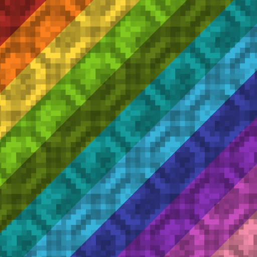

# Colored Nether Portals

**Dye your nether portals any color you want.**

  

---

## ✨ Overview

Colored Nether Portals lets you recolor any nether portal with a dye. Right-click an active
portal with a dye and the whole portal takes on that color - and the color
follows you through the full portal experience, not just the block.

## 🕹️ How to use

1. Build and light a nether portal as normal.
2. Hold any dye (e.g. Red Dye, Lime Dye, Cyan Dye…).
3. Right-click the portal.
4. The entire portal recolors instantly. Re-dye anytime to change the color; the color is
   removed automatically if the portal is broken.

## 📦 Installation

1. Install your loader of choice:
   - **Fabric** - [Fabric Loader](https://fabricmc.net/use/installer/) + [Fabric API](https://modrinth.com/mod/fabric-api)
   - **NeoForge** - [NeoForge](https://neoforged.net/)
2. Download Colored Nether Portals for your loader - [Download](https://github.com/HashDuckZ/Colored-Nether-Portals/releases)
3. Drop the `colored_nether_portals` jar into your `mods` folder.
4. Launch the game.

## ✅ Compatibility

| Minecraft | Mod version | Loaders          |
| --------- | ----------- | ---------------- |
| 1.21      | 1.0         | Fabric, NeoForge |

## 📄 License

Released under the [MIT License](LICENSE.txt).

---

Made by HashDuckZ

